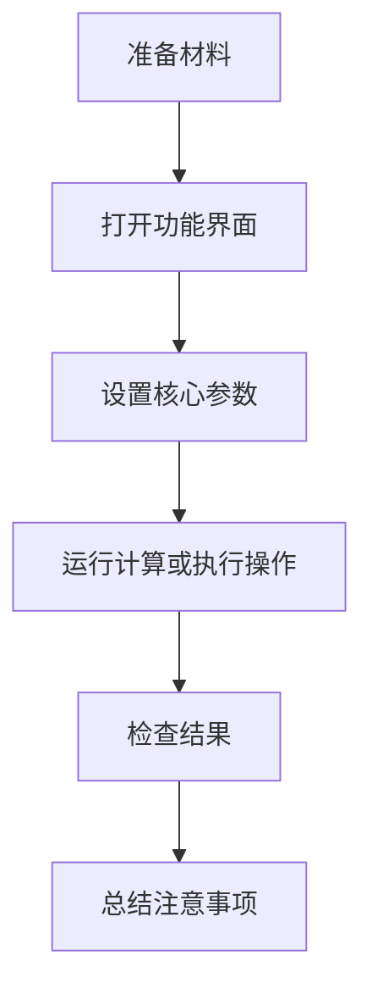

# 课程/视频标题

## 学习背景或技能树定位

说明本节内容属于哪一类知识、解决什么问题、适合在什么阶段学习。

## 理论背景

| 知识点 | 说明 | 应用场景 |
|---|---|---|
| 待补充 | 待补充 | 待补充 |

## 总体流程



## 分步骤操作

### 步骤 1：操作名称

操作目的：说明这一步要解决什么问题。

操作路径：

```text
菜单路径 -> 子菜单 -> 功能名称
```

图片：

```markdown

```

参数说明：

| 参数名称 | 设置内容 | 参数含义 |
|---|---|---|
| 待补充 | 待补充 | 待补充 |

结果解释：说明执行后界面、模型或文件发生了什么变化。

注意事项：记录容易出错的地方。

## 参数总表

| 参数名称 | 推荐设置 | 参数含义 | 影响 |
|---|---|---|---|
| 待补充 | 待补充 | 待补充 | 待补充 |

## 结果说明

| 项目 | 说明 |
|---|---|
| 操作前的问题 | 待补充 |
| 执行的功能 | 待补充 |
| 操作后的结果 | 待补充 |
| 对后续流程的意义 | 待补充 |

## 本节总结

1. 待补充。
2. 待补充。
3. 待补充。

## 图片文件检查清单

| 图号 | 图片文件名 | 是否已保存 | 备注 |
|---|---|---|---|
| 图01 | 图01_图片说明.png | 是 | 已保存至 `处理完成的截图/` |

